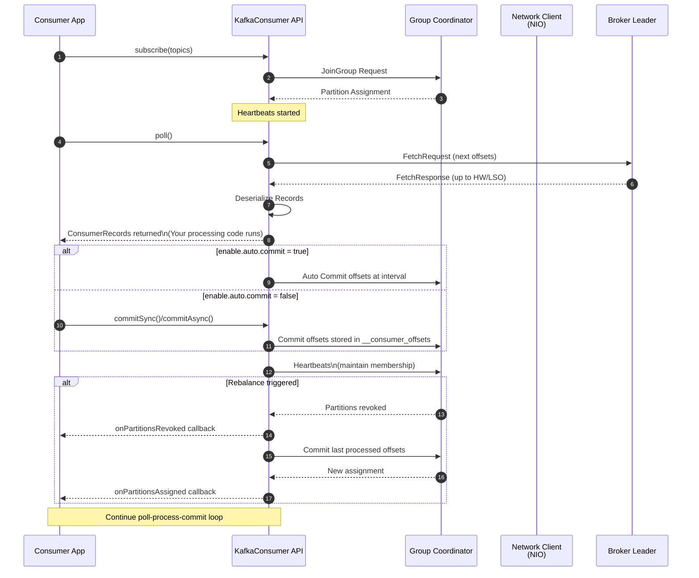

# Kafka consumer delivery path, step by step

Here is the consumer side from `poll()` to your handler.

## 1) Consumer setup and subscription

1. Your app creates a `KafkaConsumer` with deserializers, `group.id`, and configs like `auto.offset.reset`, `enable.auto.commit`, `isolation.level`.
2. You call `subscribe(topics | pattern)` or `assign(partitions)`.
3. If you used `subscribe`, the consumer joins the **group**:

   - Sends a JoinGroup to the **Group Coordinator**.
   - Receives assignment from the partition assignor (range, round-robin, cooperative-sticky, etc.).
   - Gets a **memberId** and a set of topic-partitions.

4. A background **heartbeat** loop starts. It sends heartbeats every `heartbeat.interval.ms` and must do so within `session.timeout.ms`. If heartbeats stop, the coordinator kicks the consumer from the group and triggers a rebalance.

## 2) The poll loop begins

5. Your code calls `poll(timeout)`. This is the single API that drives:

   - Heartbeats and group protocol.
   - Fetching from brokers for assigned partitions.
   - Delivery of records to your application.

## 3) Position and offset initialization

6. For each assigned partition, the consumer determines the starting **position**:

   - If a **committed offset** exists for the group, it starts at that offset.
   - If none exists, `auto.offset.reset` applies: `latest` starts at the leader’s end, `earliest` at the beginning.
   - If you called `seek`, your explicit position wins.

## 4) Fetch pipeline setup

7. The consumer maintains a per-node fetch queue. It groups partitions by their current **leader** broker.
8. It creates **FetchRequests** with:

   - The next offset per partition.
   - Byte limits: `fetch.min.bytes`, `fetch.max.bytes`, `max.partition.fetch.bytes`.
   - Isolation rules from `isolation.level` and the current **high watermark** or **last stable offset** target.

9. The **NetworkClient** reuses NIO connections, sends the batched FetchRequests to leaders, and waits for responses. Authentication and TLS happen here if configured.

## 5) Broker side read path (for context)

10. The leader broker receives the fetch and looks up the log for each partition:

    - Determines the readable limit:

      - **Read uncommitted**: up to the **High Watermark** (HW).
      - **Read committed**: up to the **Last Stable Offset** (LSO) which excludes records from open or aborted transactions.

    - Gathers record batches from segment files and returns them, often compressed, possibly using **fetch sessions** to reduce overhead across polls.

11. The broker enforces throttles if quotas are in place and sends the **FetchResponse**.

## 6) Response handling and decompression

12. The consumer receives the response and updates per-partition **fetched position** (internal cursor) to the last returned offset + 1.
13. Batches are stored in the consumer’s in-memory buffers. Decompression happens per batch based on the batch attribute.
14. The consumer constructs `ConsumerRecord` objects lazily as you iterate results from `poll()`.

## 7) Visibility rules that decide what you can read

15. **High Watermark (HW)**: last offset replicated to ISR. Used for `read_uncommitted`.
16. **Last Stable Offset (LSO)**: last offset below any open transaction. Used for `read_committed`. Records from aborted transactions are hidden, and control markers guide skipping.
17. **Log append time vs create time** affects the timestamp you observe in `ConsumerRecord.timestamp()` depending on topic config.

## 8) Delivery to your application

18. `poll()` returns a `ConsumerRecords` batch, grouped by topic-partition, up to `max.poll.records`.
19. Your code iterates the records, runs business logic, and decides when to commit offsets.

## 9) Offset management

20. Offsets are **consumer-group state**, stored in the internal `__consumer_offsets` topic.
21. **Auto-commit on** (`enable.auto.commit=true`):

    - A background task commits the latest returned offsets at `auto.commit.interval.ms`.
    - Risk: if your processing fails after poll and before the next poll, offsets may advance and you can skip messages.

22. **Manual commit** (`enable.auto.commit=false`):

    - `commitSync()` blocks until the coordinator confirms.
    - `commitAsync()` sends and returns immediately; you can add a callback to handle failures.
    - Typical pattern commits after processing succeeds to achieve at-least-once delivery.

23. Offset granularity is **per partition** and stored as “next to read” offset, not “last processed.”

## 10) Rebalances and partition revocation

24. A rebalance occurs when membership or subscriptions change, or when a consumer is considered dead:

    - The coordinator revokes partitions from some members and assigns them to others.
    - Your **rebalance listener** can flush and commit last processed offsets on `onPartitionsRevoked`.
    - With **cooperative** assignors, revocation can be incremental to reduce stop-the-world pauses.

25. After rebalance, the consumer seeks to the last committed offsets for newly assigned partitions and resumes fetching.

## 11) Flow control and backpressure

26. The consumer controls throughput through:

    - `max.poll.records` to cap records per poll.
    - `fetch.min.bytes` and `fetch.max.wait.ms` to trade latency for batching.
    - `max.partition.fetch.bytes` to cap per-partition payload size.

27. Your app can **pause** partitions with `pause()` to stop new fetches and **resume** later. This is key for downstream backpressure.
28. If your app does not call `poll()` frequently enough, you risk:

    - **Session timeout** violations leading to rebalances.
    - **max.poll.interval.ms** violations, which also cause removal from the group.

## 12) Error handling and recovery

29. **Retriable fetch errors** (leader moved, transient network) trigger metadata refresh and transparent retry in the next polls.
30. **Deserialization errors** happen in the client. You must handle them, often by sending the bad record to a DLQ and committing past it intentionally.
31. **Authorization errors** or unknown topic-partition cause exceptions and typically halt processing for those partitions.

## 13) Exactly-once and transactions (reader side)

32. With **idempotent producers** plus **transactions** and consumer `isolation.level=read_committed`:

    - The consumer only sees messages from **committed** transactions.
    - It skips batches marked aborted using control markers.

33. When building read-process-write pipelines, use **transactional producer** and **consume-transform-produce** with **EOS** patterns so that offsets and output writes commit atomically.

## 14) Shutdown sequence

34. Your app signals shutdown, stops fetching, finishes processing current records, commits offsets deliberately, then calls `close()`.
35. The consumer leaves the group, allowing a clean, fast rebalance for remaining members.

---

## Quick mental model

- `poll()` is the engine. It drives heartbeats, fetches, and delivery.
- The broker only serves up to HW or LSO, depending on isolation.
- Your commit policy defines delivery semantics:

  - Auto-commit gives convenience with risk of skips.
  - Manual commit after success gives at-least-once.
  - Transactions plus read_committed enable exactly-once in pipelines.




An example in Java:

```java
import org.apache.kafka.clients.consumer.ConsumerRecord;
import org.apache.kafka.clients.consumer.ConsumerRecords;
import org.apache.kafka.clients.consumer.KafkaConsumer;
import org.apache.kafka.common.serialization.StringDeserializer;

import java.time.Duration;
import java.util.Arrays;
import java.util.Properties;

public class OrderConsumer {

    public static void main(String[] args) {

        // Step 1: Consumer configuration
        Properties props = new Properties();
        props.put("bootstrap.servers", "localhost:9092");
        props.put("group.id", "order-processing-group");
        props.put("key.deserializer", StringDeserializer.class.getName());
        props.put("value.deserializer", StringDeserializer.class.getName());

        // Disable auto-commit to avoid skipping messages after failure
        props.put("enable.auto.commit", "false");

        // Protection against slow processing (tune depending on workload)
        props.put("max.poll.interval.ms", "300000"); // 5 minutes

        KafkaConsumer<String, String> consumer = new KafkaConsumer<>(props);

        // Step 2: Subscribe to topics and join group
        consumer.subscribe(Arrays.asList("orders"));

        try {
            while (true) {

                // Step 3: poll drives fetching, heartbeats, delivery
                ConsumerRecords<String, String> records =
                        consumer.poll(Duration.ofMillis(500));

                for (ConsumerRecord<String, String> record : records) {

                    System.out.println("Received: " +
                            "topic=" + record.topic() +
                            ", partition=" + record.partition() +
                            ", offset=" + record.offset() +
                            ", key=" + record.key() +
                            ", value=" + record.value());

                    // Step 4: process message
                    processOrder(record);
                }

                // Step 5: manual commit only after successful processing
                consumer.commitSync();
            }
        } catch (Exception e) {
            System.out.println("Processing failed. No commit. Will reprocess on restart.");
        } finally {
            System.out.println("Closing consumer and leaving group.");
            consumer.close();
        }
    }

    private static void processOrder(ConsumerRecord<String, String> record) throws Exception {
        // Your business logic goes here
        if (record.value().contains("FAIL")) {
            throw new RuntimeException("Simulated failure for testing");
        }
    }
}
```

and using the `assign` method to assign a partition:

```java
TopicPartition tp = new TopicPartition("orders", 0);
consumer.assign(Arrays.asList(tp));

// Seek to a specific offset
consumer.seek(tp, 25);

while (true) {
    ConsumerRecords<String, String> records =
            consumer.poll(Duration.ofMillis(500));

    for (ConsumerRecord<String, String> r : records) {
        System.out.println("offset=" + r.offset() + " value=" + r.value());
    }
}
```


