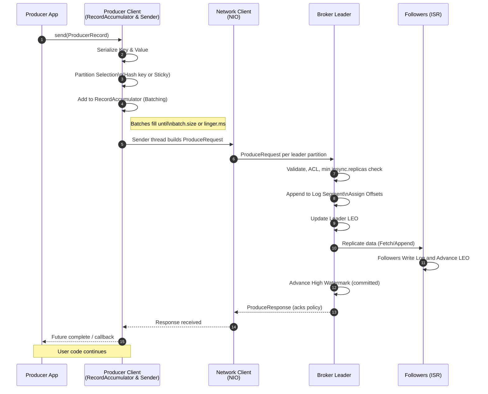

# Kafka producer message flow

## 1) App call enters the Producer API

1. You create a `ProducerRecord(topic, key, value, headers, timestamp?)`.
2. The producer client validates the record, serializes key and value using the configured serializers, and applies any header transformations.

```java
String topic = "orders";
String key = "ORDER-1001";
String value = "{\"orderId\":1001,\"amount\":2500,\"currency\":\"INR\"}";
long timestamp = Instant.now().toEpochMilli();

ProducerRecord<String, String> record =
        new ProducerRecord<>(
                topic,
                null,               // partition (null lets Kafka choose based on key hash)
                timestamp,
                key,
                value,
                java.util.Arrays.asList(
                        new RecordHeader("source", "web-app".getBytes(StandardCharsets.UTF_8)),
                        new RecordHeader("eventType", "orderCreated".getBytes(StandardCharsets.UTF_8))
                )
        );
```

## 2) Cluster metadata and partition choice

3. The producer checks its local cluster metadata cache. If it is empty or stale, it asks the bootstrap broker(s) for metadata and caches topic→partitions, leaders, and API versions.
4. The partitioner picks a target partition:

   - If a partition is explicitly set in the record, it uses that.
   - Else, if there is a key, it hashes the key to choose a partition deterministically.
   - Else, if there is no key, the partitioner picks one partition and sticks to it for a short time window or until a batch is full, to improve batching.

## 3) RecordAccumulator: batching and buffering

5. The serialized record is appended to an in-memory per-partition buffer called the `RecordAccumulator`.
6. Batching rules:

   - Batches are per topic-partition and grow until they reach `batch.size` bytes, or `linger.ms` expires, or a flush is triggered.
   - Compression (`compression.type`) is applied at the batch level, not per record, to improve ratio.

7. Flow control:

   - All batches share a global `buffer.memory`. If buffers are full, `send()` will block up to `max.block.ms` or throw.

## 4) The Sender I/O thread and the NetworkClient

8. A dedicated Sender thread drains ready batches from the `RecordAccumulator`. A batch is “ready” if:

   - It is full, or linger time elapsed, or the partition leader changed, or a flush is requested.

9. The Sender groups batches by destination broker and builds one or more `ProduceRequest`s.
10. The `NetworkClient` multiplexes requests over nonblocking NIO sockets. It handles:

- Connection setup, TCP, optional SSL/TLS handshake, optional SASL auth.
- Per-node in-flight request limits `max.in.flight.requests.per.connection`.
- Timeouts: `request.timeout.ms` and the envelope `delivery.timeout.ms`.

## 5) Idempotence and transactions (if enabled)

11. If `enable.idempotence=true`:

- The producer obtains a Producer ID (PID) and epoch from the cluster.
- Each batch to a given partition carries a monotonically increasing sequence number.
- Brokers use PID+partition+sequence to deduplicate on retry, so duplicates are not appended.

12. If using transactions:

- The producer first initializes a transactional ID and PID with the Transaction Coordinator.
- It wraps one or more sends and optionally consumer offsets in a transaction, then issues COMMIT or ABORT.
- The coordinator writes control markers to the affected partitions so consumers using “read_committed” can hide aborted data.

## 6) Broker receive path

13. The target broker’s socket server hands the request to the request handler pool.
14. The broker validates the topic-partition, ACLs, and required acks against `min.insync.replicas`. If the ISR is too small for `acks=all`, the broker rejects with an error.
15. For each partition in the request, the leader replica appends the batch to its log:

- The log is a set of segment files with an index. Kafka stores records in compressed batches.
- Each record gets a monotonically increasing offset. The leader updates its Log End Offset (LEO).
- Timestamps are either “CreateTime” from the producer or “LogAppendTime” if the topic is configured that way.
- Data lands in the OS page cache. Kafka relies on the OS for flush; `flush.ms`/`flush.messages` control forced fsync only if configured.

## 7) Replication to followers and high watermark

16. Followers pull data from leaders using fetch requests. They append to their local logs.
17. Once a record is present on all replicas in the In-Sync Replica set (ISR), the leader can advance the High Watermark (HW).
18. The HW marks the last offset that is considered committed. Consumers in read_committed mode will never read past HW for transactional topics.

## 8) Ack policy and the response to the producer

19. `acks=0`: the broker does not send a Produce response. The producer marks the send complete locally when it writes to the socket. Lowest latency, lowest durability.
20. `acks=1`: the leader appends to its local log and immediately replies success. Durability depends on the leader staying alive.
21. `acks=all` (or `-1`): the leader waits until the record is replicated to the ISR and HW advances, then replies. This pairs with `min.insync.replicas` for stronger durability.
22. The response includes the base offset assigned to the batch, a timestamp, and any errors. With idempotence, the broker also validates sequence numbers.

## 9) Retries, ordering, and error handling

23. If the producer sees a retriable error (network issue, leader moved, not enough replicas, timeout), it refreshes metadata if needed and retries up to `retries` within `delivery.timeout.ms`.
24. Ordering:

- Per-partition ordering is preserved because the producer sends batches per partition in sequence, and idempotence enforces sequence checks.
- If `max.in.flight.requests.per.connection` is high, multiple batches for the same partition can be in flight. Modern brokers and clients maintain ordering per partition even with retries by failing out-of-order sequences rather than reordering.

25. Non-retriable errors (unknown topic-partition after all refresh, authorization failures, invalid config) complete the future with an exception.

## 10) Callback completion and metrics

26. When a response arrives or a terminal error occurs, the producer completes the `Future<RecordMetadata>` and runs your callback if provided.
27. The client updates metrics:

- Batch sizes, compression ratio, records per request, retries, error rates, request latency, `record-queue-time` (linger), `request-latency`, and produce throttle time if quotas kick in.

## 11) What ends up on disk

28. The leader’s log segment now contains a compressed record batch with:

- Magic/version, attributes (compression, timestamp type), producer ID/epoch if applicable, base sequence, batch CRC.
- The records with headers, keys, values, and per-record timestamps.

29. Segment indexes are updated:

- Offset index maps relative offsets to file positions.
- Time index maps timestamps to offsets for time-based queries.
- There may be leader-epoch checkpoints used for fencing and truncation after leadership changes.

## 12) Ongoing housekeeping that affects delivery

30. Metadata refresh continues in the background at `metadata.max.age.ms` or on errors.
31. If the leader changes, the producer reroutes subsequent batches after a metadata update.
32. If transactions are used, the coordinator writes commit or abort markers. Consumers with `isolation.level=read_committed` will only see committed data.

## Key knobs you control on the producer

- Durability/latency: `acks`, `min.insync.replicas` (broker/topic), `linger.ms`, `batch.size`, `compression.type`.
- Safety: `enable.idempotence`, `retries`, `delivery.timeout.ms`, `max.in.flight.requests.per.connection`.
- Throughput: `buffer.memory`, `linger.ms`, `batch.size`, compression.
- Ordering: per-partition ordering guaranteed; use a key to pin related events to the same partition.


