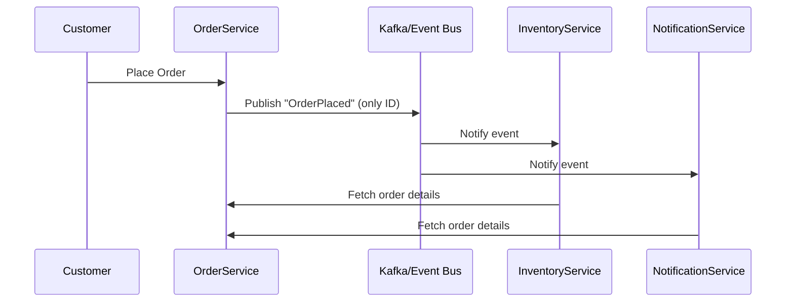
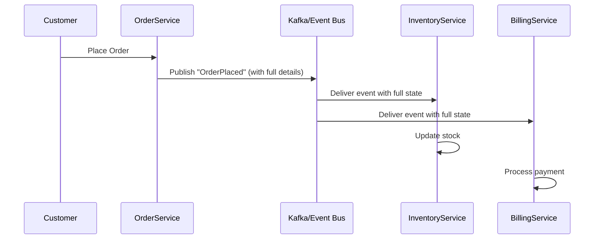
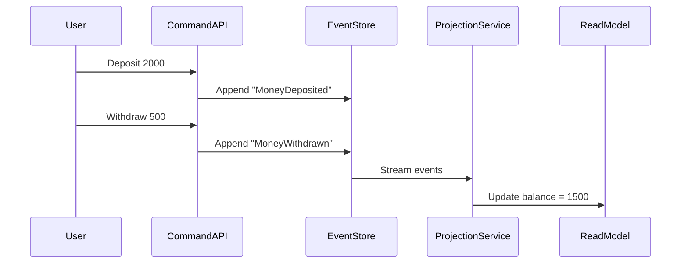

# Design Patterns and Anti-Patterns in Event-Driven Architecture

Event-Driven Architecture (EDA) enables systems to **react to events in real time**, promoting **loose coupling**, **asynchronous communication**, and **high scalability**.
But, designing an effective EDA solution requires understanding both **what to do (patterns)** and **what not to do (anti-patterns)**.

This post explores three essential **EDA design patterns** — Event Notification, Event-Carried State Transfer, and Event Sourcing — along with common **EDA anti-patterns** you must avoid.

## 1. Event Notification Pattern

### Concept

The **Event Notification** pattern is the simplest EDA design.
The producer publishes an event **just to signal that something happened**, without including detailed state data.
Consumers react by fetching necessary information from the producer or another source.

It’s like saying, _“Hey, something changed — go check it out!”_

### Example Scenario

In an **e-commerce system**:

- When an order is placed, the `OrderPlaced` event is published.
- The `InventoryService` and `NotificationService` subscribe to this event to act accordingly.

```json
{
  "eventType": "OrderPlaced",
  "orderId": "ORD12345",
  "timestamp": "2025-10-31T09:10:00Z"
}
```

Both consumers must query the **Order Service API** to get full details.

### Diagram (Event Notification)



### When to Use

- When **small events** are preferable.
- When consumers can **query additional details** directly.
- When all services are **within the same network boundary**.

### Drawbacks

- Causes **temporal coupling** (consumers depend on producer availability).
- Can increase **latency** if multiple consumers fetch data simultaneously.

## 2. Event-Carried State Transfer Pattern

### Concept

The **Event-Carried State Transfer** pattern eliminates the need for consumers to fetch state.
Each event **carries all relevant data** required for processing.

This promotes **loose coupling** and **independent consumption** of events.

### Example Scenario

Continuing the e-commerce example:

- When an order is placed, the producer emits a rich `OrderPlaced` event that contains the full order details.

```json
{
  "eventType": "OrderPlaced",
  "orderId": "ORD12345",
  "customerId": "CUST001",
  "items": [{ "productId": "P123", "quantity": 2, "price": 499.0 }],
  "totalAmount": 998.0,
  "status": "PLACED",
  "timestamp": "2025-10-31T09:10:00Z"
}
```

Consumers like `InventoryService` and `BillingService` can process this event directly — without querying the `OrderService`.

### Diagram (Event-Carried State Transfer)



### When to Use

- When consumers need **full context** to process events.
- When services are **loosely coupled** and **autonomous**.
- For **real-time synchronization** across services.

### Drawbacks

- **Increased payload size** → more bandwidth usage.
- **Data duplication** across consumers.
- Requires **schema versioning discipline**.

## 3. Event Sourcing Pattern

### Concept

In **Event Sourcing**, every state change in the system is captured as an **immutable event**.
Instead of storing the latest state, the system stores a **sequence of events** that can be replayed to reconstruct the state at any point in time.

The **event log becomes the system of record**.

### Example Scenario

In a **banking system**:

- Instead of storing just the account balance, the system records all transactions as events.

```json
{
  "eventType": "MoneyDeposited",
  "accountId": "ACC123",
  "amount": 2000,
  "timestamp": "2025-10-31T10:00:00Z"
}
```

```json
{
  "eventType": "MoneyWithdrawn",
  "accountId": "ACC123",
  "amount": 500,
  "timestamp": "2025-10-31T10:10:00Z"
}
```

To compute the current balance, the system **replays events** in order.

### Diagram (Event Sourcing)



### Benefits

- **Full audit trail** (perfect for compliance).
- **Replayability** for debugging, analytics, or rebuilding state.
- Supports **temporal queries** (“what was the balance last week?”).

### Challenges

- Requires **schema evolution** handling over time.
- Rebuilding state from events can be **slow** without snapshots.
- Needs a separate **read model** (CQRS pattern) for efficient queries.

# EDA Anti-Patterns

Understanding anti-patterns helps you **avoid hidden pitfalls** that can undermine your architecture.
Here are the most common ones in EDA systems.

## 1. Event Storming Without Boundaries

**Event Storming** is a great technique for domain modeling — but becomes dangerous when done without **bounded context**.
Teams end up with hundreds of events and unclear ownership.

**Problem:** No one knows which service owns which event.

**Fix:** Use **Domain-Driven Design (DDD)** to define clear **bounded contexts** (e.g., `Order`, `Payment`, `Inventory`).

## 2. Chatty Eventing

When systems emit **too many fine-grained events**, it causes **network overhead** and **cognitive overload**.

**Example:** Sending an event for every field change (`PriceChanged`, `QuantityUpdated`, `TaxUpdated`) instead of a consolidated `OrderUpdated`.

**Fix:** Use **aggregate-level events** and **batching** when possible.

## 3. Schema Neglect

Ignoring schema management leads to consumer failures.
Adding fields without schema evolution planning can break older services.

**Fix:**

- Use a **Schema Registry**.
- Enforce **compatibility checks** in CI/CD.

## 4. Using Kafka as a Database

Kafka is a **streaming platform**, not a **data store**.
Treating it like a database (with compacted topics for CRUD operations) leads to **consistency and query limitations**.

**Fix:** Store canonical state in a **database**, and use Kafka for **change propagation**.

## 5. Single-Topic Design Mistake

Dumping all events into a single topic (`all-events`) quickly becomes unmanageable.

**Fix:**
Use **domain-based topics** like `orders`, `payments`, `shipments`.
Ensure each topic has **well-defined schemas**.

## 6. Ignoring Backpressure

If producers emit faster than consumers process, message queues grow uncontrollably.

**Fix:**

- Monitor **consumer lag**.
- Implement **rate limiting**, **load balancing**, and **flow control**.

## 7. Poor Schema Governance

Even with a schema registry, lack of governance allows accidental breaking changes.

**Fix:**

- Conduct **schema reviews**.
- Assign **event ownership**.
- Automate **compatibility validation**.

# Summary Table

| Category       | Pattern / Anti-Pattern                | Key Principle                              |
| -------------- | ------------------------------------- | ------------------------------------------ |
| Design Pattern | **Event Notification**                | Lightweight event triggers follow-up calls |
| Design Pattern | **Event-Carried State Transfer**      | Include necessary state in the event       |
| Design Pattern | **Event Sourcing**                    | Persist all changes as immutable events    |
| Anti-Pattern   | **Event Storming Without Boundaries** | Leads to unclear ownership                 |
| Anti-Pattern   | **Chatty Eventing**                   | Too many small events cause overhead       |
| Anti-Pattern   | **Schema Neglect**                    | No schema evolution or validation          |
| Anti-Pattern   | **Using Kafka as DB**                 | Violates event-streaming purpose           |
| Anti-Pattern   | **Single-Topic Design**               | Reduces scalability and clarity            |
| Anti-Pattern   | **Ignoring Backpressure**             | Causes lag and message loss                |
| Anti-Pattern   | **Poor Schema Governance**            | Creates compatibility chaos                |

# Closing Thoughts

EDA offers enormous power — real-time responsiveness, scalability, and flexibility — but only when designed with **discipline**.
The key lies in choosing the **right event pattern** for the right use case and maintaining **strong schema governance** and **bounded contexts**.

A well-architected EDA system is not one that just moves data around,
but one that moves **meaningful events** through a **well-governed ecosystem** of loosely coupled services.
