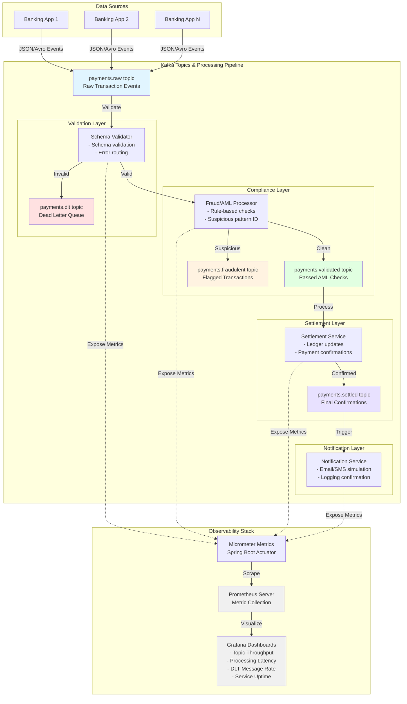

# Student Implementation Guide

## Capstone Project: Real-Time Payment Processing System using Apache Kafka

### 1. Introduction

This guide is designed to help you plan, organize, and implement the _Real-Time Payment Processing System_ project effectively. The objective is not just to complete the system but to **build it the way a professional engineering team would design a real-world Kafka-based streaming architecture**.

You will be building multiple interacting microservices connected through Apache Kafka, focusing on event-driven design, schema validation, fault-tolerance, testing, and observability.

This document provides the _how-to_ approach, not the exact implementation.

### 2. Project Goals Recap

You are required to design and build a distributed, event-driven payment system that supports:

- Multiple producer applications generating payment events
- Kafka-based ingestion and event routing
- Fraud/AML verification
- Settlement workflow
- Notification generation
- Schema validation and Dead Letter Topic handling
- Unit & integration testing
- Observability via Prometheus and Grafana

### 3. Recommended Development Environment

**Core Requirements**

- Java 17+
- Spring Boot (latest stable version)
- Apache Kafka (locally installed or via Docker)
- Confluent Schema Registry (for Avro/JSON Schema)
- Maven or Gradle for build
- Prometheus & Grafana for monitoring
- Git for version control

**Optional Tools**

- Docker Compose for running the Kafka ecosystem
- ksqlDB for stream exploration and debugging
- Postman / Curl for triggering test messages

### 4. Step-by-Step Implementation Roadmap

#### **Phase 1: Environment Setup**

**Objective:** Get your Kafka ecosystem ready.

**Tasks:**

1. Install or set up Kafka (with ZooKeeper or KRaft).
2. Create the following topics with meaningful partition counts:

   - `payments.raw`
   - `payments.validated`
   - `payments.fraudulent`
   - `payments.settled`
   - `payments.dlt`

3. Verify topic creation using:

   ```bash
   kafka-topics.sh --bootstrap-server localhost:9092 --list
   ```

4. Install Schema Registry (if using Avro/JSON Schema).
5. Set up a local Prometheus and Grafana instance for later monitoring.

> **Tip:** Keep a separate configuration file (`kafka-topics.txt`) listing all topic names, partition counts, and retention settings.

#### **Phase 2: Producer Applications (Banking Apps)**

**Objective:** Simulate multiple producer applications publishing real-time payment transactions.

**Guidelines:**

- Create 2–3 Spring Boot producer apps representing different banks.
- Each should produce messages with the structure:

  ```json
  {
    "txId": "T12345",
    "sourceAccount": "1234567890",
    "destinationAccount": "9876543210",
    "txType": "NEFT",
    "amount": 12500.5,
    "timestamp": "2025-10-30T11:25:30Z"
  }
  ```

- Configure producers to publish events at regular intervals.
- Use **JSON or Avro** serializers and link them to the Schema Registry.

> **Tip:** Start by manually publishing messages using `kafka-console-producer` to test connectivity before coding.

> **Hint:** Each producer can have a unique header like `appId=BANK_A`, `appId=BANK_B` to simulate different banks.

#### **Phase 3: Schema Validation and DLT**

**Objective:** Enforce message structure and handle malformed events.

**Guidelines:**

- Define a schema for the `payments.raw` topic.
- Configure a consumer that validates messages against this schema.
- If validation fails or deserialization errors occur, publish the invalid messages to a `payments.dlt` topic.

> **Tip:** The DLT message should include fields like:

```json
{
  "originalMessage": "...",
  "errorReason": "Schema validation failed",
  "timestamp": "..."
}
```

> **Hint:** Consider using Confluent’s Schema Registry and `KafkaAvroDeserializer` for strict validation.

#### **Phase 4: Fraud/AML Service**

**Objective:** Filter valid transactions and detect suspicious or fraudulent ones.

**Guidelines:**

- Create a Kafka Streams or Spring Cloud Stream application consuming `payments.raw`.
- Implement mock rules such as:

  - High-value transactions (`amount > 100000`)
  - Rapid multiple transfers from the same account

- Publish results to:

  - `payments.validated` (passed)
  - `payments.fraudulent` (flagged)

> **Tip:** Use state stores (if using Kafka Streams) to remember recent transactions per account for temporal checks.

> **Hint:** Keep the rules simple but parameterized — load them from a config file for flexibility.

#### **Phase 5: Settlement Service**

**Objective:** Simulate account settlement after validation.

**Guidelines:**

- Consume `payments.validated`.
- Mock account balance updates or ledger entries (no database required).
- Produce confirmation events to `payments.settled`.

> **Tip:** Include settlement metadata:

```json
{
  "txId": "T12345",
  "status": "SETTLED",
  "settledAt": "2025-10-30T11:27:30Z"
}
```

> **Hint:** Use `KTable` joins or an in-memory map if you want to simulate account balances.

#### **Phase 6: Notification Service**

**Objective:** Notify customers once payments are settled.

**Guidelines:**

- Consume from `payments.settled`.
- Simulate notifications by logging or producing events to a `notifications.sent` topic.
- Example output:

  ```
  Notification sent to 1234567890: Your payment of ₹12500.50 has been settled successfully.
  ```

> **Tip:** Keep the notification logic asynchronous. Treat it as a separate microservice.

#### **Phase 7: Observability and Monitoring**

**Objective:** Measure and visualize system performance and reliability.

**Guidelines:**

- Add **Micrometer** in each Spring Boot service.
- Expose Prometheus endpoints at `/actuator/prometheus`.
- Set up Prometheus to scrape these metrics.
- Build a Grafana dashboard showing:

  - Message throughput per topic
  - Consumer lag
  - Error counts (DLT volume)
  - Processing latency per service

> **Hint:** Start with the default Spring Boot Prometheus metrics before adding Kafka-specific ones.

> **Tip:** Log event flow counts in each microservice — this will also help in debugging.

#### **Phase 8: Testing and Validation**

**Objective:** Ensure reliability through automated testing.

**Guidelines:**

- Write **unit tests** for individual components (validation, fraud rule logic, etc.).
- Use **EmbeddedKafka** for **integration tests**:

  - Start an in-memory Kafka broker.
  - Produce and consume messages within the test context.
  - Assert expected results.

> **Hint:** Do not use any production logic (like `CountDownLatch`) to synchronize tests.
> Use Awaitility or polling assertions instead.

> **Tip:** Target at least 70% code coverage across core modules.

#### **Phase 9: Documentation**

**Objective:** Present your project professionally.

**Checklist:**

- Include a top-level `README.md` with:

  - Project overview
  - How to run each service
  - Kafka topic definitions
  - Monitoring setup steps

- Add architecture and topic flow diagrams.
- Include screenshots of Grafana dashboards and test results.

> **Hint:** Use PlantUML or draw.io for diagrams.

### 5. Suggested Timeline

| Week | Deliverable                         | Key Outcome                          |
| ---- | ----------------------------------- | ------------------------------------ |
| 1    | Environment Setup + Kafka Topics    | Kafka ecosystem ready                |
| 2    | Producers + Schema Validation + DLT | Raw message flow functional          |
| 3    | Fraud/AML + Settlement Services     | Core processing pipeline operational |
| 4    | Notification + Observability        | End-to-end visibility achieved       |
| 5    | Testing + Documentation             | Final review and submission          |

### 6. Evaluation Preparation

Before submitting, ensure the following:

- Each topic has active messages (you can show this using `kafka-console-consumer`).
- DLT contains a few failed records (prove validation works).
- Grafana dashboard shows live metrics.
- Test reports demonstrate both functional and negative test cases.
- Documentation explains your design choices clearly.

### 7. Learning Outcomes

By completing this project, you will:

- Develop an understanding of **Kafka as a backbone for distributed event-driven systems**.
- Learn **how to design and test** microservices that interact asynchronously.
- Gain hands-on experience with **schema evolution, monitoring, and resilience patterns**.
- Build confidence in deploying real-time data pipelines suitable for FinTech or enterprise environments.


